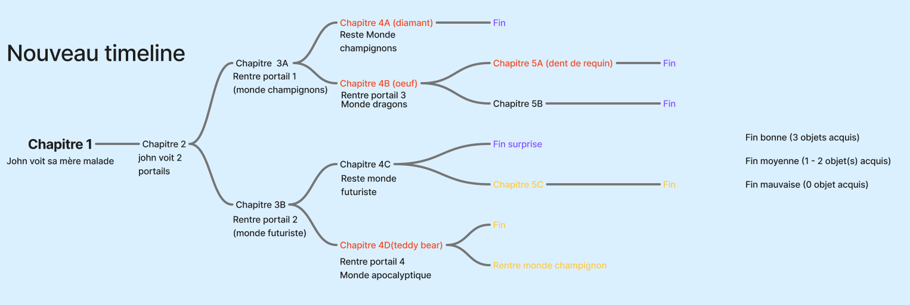

# Brief de Projet - À fournir à l'équipe testeuse

**Nom de votre équipe :** Studio John  
**Nom du projet :** Ox bezoar temporel  
**Type de projet :** Trace ton chemin  
**Date :** 3 décembre 2024

---

## 🔗 Accès au projet

**URL du site déployé :**

[Github Pages](https://fenrir0wulf.github.io/webapp-creative-Benoit-Dana-TingYung-William/)

## 🔗 Accès à votre Trello pour l'ajout de fiches de bogues

- À partir de Trello, Cliquez sur *Partager* en haut à droite de votre tableau.
- Ensuite, *Créer un lien*.
- Finalement, *Copier le lien* et l'amener ici (puis supprimer les instructions sous le titre de la section actuelle).
[Trello](https://trello.com/b/9Pcw7dFa/projet-web)

---

## 📖 Description du projet

### Concept général

Histoire intéractive dans lequel vous êtes John et vous devez sauver vôtre maman. Dans ce récit excitant, vous allez de monde en monde afin d'obtenir des objets pour redirectionner le destin de ta mère.

## ✅ Fonctionnalités implémentées (DONC À TESTER)

### PRIORITÉ HAUTE (fonctionnalités principales)

#### Pour "Trace ton chemin"

Remplacer le [X] par le nombre réel de votre projet

- [x] Lecture de 16 chapitres
- [x] Système de choix fonctionnel
- [x] 7 branches narratives
- [x] 4 fins différentes accessibles
- [x] Tracking de [karma/stats/inventaire/flags]
- [x] Historique des décisions (dans un menu ou à la fin)

### PRIORITÉ MOYENNE

- [ ] Responsive (mobile, tablette, desktop)
- [ ] [Autre fonctionnalité] (à vous de mentionner les priorités moyennes à tester pour votre projet)

### PRIORITÉ BASSE (bonus si temps)

- [ ] [Fonctionnalité bonus] (à vous de mentionner les priorités basses à tester pour votre projet)

---

## ❌ Fonctionnalités NON implémentées

**Important : Ne PAS reporter ces éléments comme bugs**

S'il y a des choses qui n'ont pas été faites dans votre projet et qui ne sont donc à ne pas tester, veuillez les lister ici pour laisser savoir à vos testeurs plutôt que de les faires chercher pour rien.

- ❌ Sauvegarde LocalStorage (en cours)
- ❌ Animations GSAP (optionnelles - pas faites)
- ❌ Mode sombre

---

## 🧪 Cas de test suggérés

Suggérez au testeurs de tester des cas précis dans votre appli. Listez-les cas ici.

### Test 1 : [Nom du test]

**Objectif :** Vérifier que [fonctionnalité] fonctionne

**Étapes :**

1. [Action 1]
2. [Action 2]
3. [Action 3]

**Résultat attendu :**
[Ce qui devrait se passer]

---

### Test 2 : [Nom du test]

**Objectif :** [Description]

**Étapes :**

1. [Action 1]
2. [Action 2]

**Résultat attendu :**
[Ce qui devrait se passer]

---

### Test 3 : Responsive mobile

**Objectif :** Vérifier que le site fonctionne sur mobile

**Étapes :**

1. Ouvrir DevTools (F12)
2. Activer le mode device (icône téléphone/tablette)
3. Sélectionner "iPhone SE" ou 375px
4. Tester les fonctionnalités principales

**Résultat attendu :**

- Tout s'affiche correctement (pas de débordement)
- Navigation fonctionne
- Boutons sont assez grands pour être cliqués

---

## 🐛 Problèmes connus (Ne PAS les reporter)

**Ces problèmes sont déjà identifiés et documentés :**

- Sauvegardes pas fini
- Inventaire pas fini
- Responsive à travailler
- Pas sortir de sauvegardes sans flèche
- Pas retourner au menu sans flèche

---

## 🎯 Zones à tester en priorité

**Nous aimerions que vous testiez particulièrement :**

1. La version mobile (nous l'avons peu testée)
2. Toutes les fins de l'histoire (pour vérifier qu'elles sont atteignables) (optionnel)

---

## 📱 Appareils et navigateurs testés par nous

**Ce que nous avons déjà testé :**

- ✅ Edge (Desktop)
- ✅ Chrome (Desktop)
- ✅ Firefox (Desktop)
- ⚠️ 
- ❌

**Ce que vous pourriez tester en plus :**

- Safari (si vous avez un Mac/iPhone)
- Brave
- Opera GX
- Sur vos vrais téléphones
- Sur vraie tablette

---

## 🗺️ Structure du projet (Pour "Trace ton chemin")

**Arbre narratif simplifié :**

**Liste des fins accessibles :**

1. Fin bonne - Condition : Obtenir 3 objets
2. Fin moyenne - Condition : Obtenir 1/2 objets
3. Fin mauvaise - Condition : Obtenir 0 objet
4. Fin surprise - Condition : Prendre le choix (Suivre ArK-9X) au chapitre 7

---

## 📞 Contact

**Pour questions urgentes ou clarifications :**

- Teams : @Lu, Ting Yung

**Disponibilité :**

- Réponse rapide sur Teams pendant les heures de travail
- Possibilité de meeting rapide (15-20 min) si nécessaire

---

## 💬 Notes additionnelles

[Toute autre information utile pour les testeurs]

non
