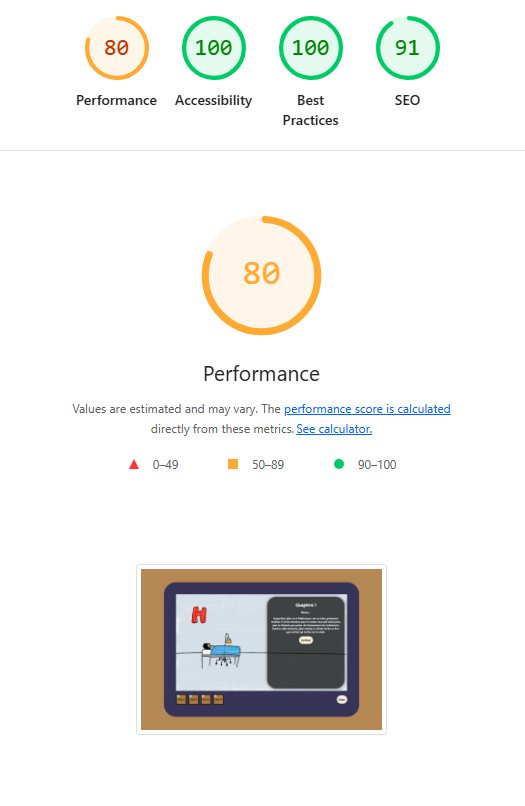
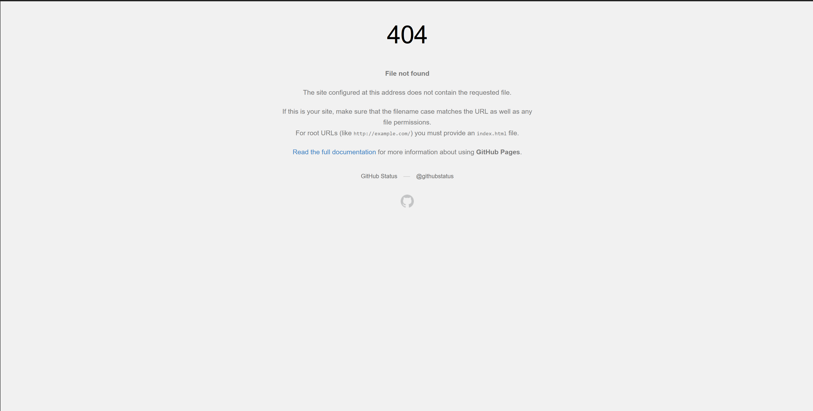
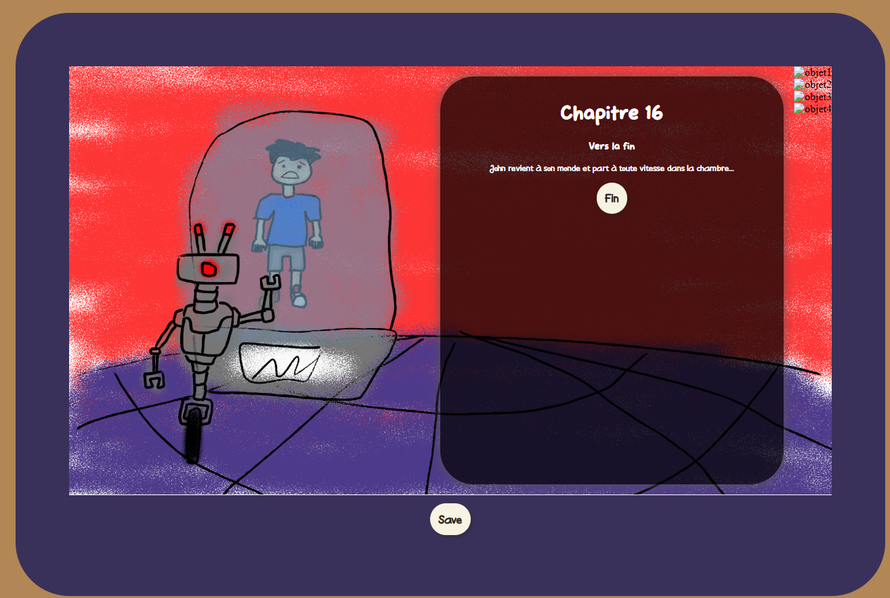
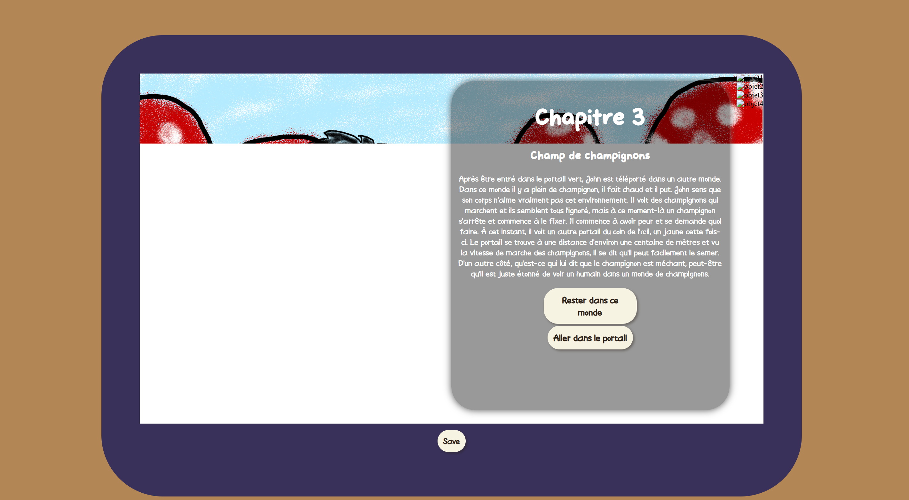
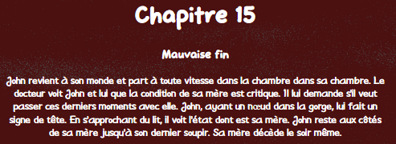

# Rapport de Contrôle Qualité

**Nom de l'équipe :** Studio John     
**Nom du projet :** Ox Bezoar    
**Type de projet :** Trace ton chemin    
**Date :** 8 décembre 2024

## 📋 Table des matières

1. [Informations générales](#1-informations-générales)
2. [PARTIE 1 : Tests externes](#2-partie-1-tests-externes)
3. [PARTIE 2A : Tests internes](#3-partie-2a-tests-internes)
4. [PARTIE 2B : Bogues reçus](#4-partie-2b-bugs-reçus)
5. [PARTIE 2C : Plan de corrections](#5-partie-2c-plan-de-corrections)
6. [Accessibilité](#6-accessibilité)
7. [Performance](#7-performance)
8. [Conclusion](#8-conclusion)
9. [Annexes](#9-annexes)

---

## 1. Informations générales

### Équipe

| Membre | Rôle dans les tests | Heures consacrées |
|--------|---------------------|-------------------|
| Ting Yung | Tests externes + internes | 2 heures |
| William | Tests externes + internes | 2 heures |
| Benoit Rochon | Tests internes + corrections | 2 heures |
| Dana | Tests accessibilité + performance | 1 heures |

**Total d'heures de QA :** [5] heures

### Liens importants

- **Projet en ligne :** [https://fenrir0wulf.github.io/webapp-creative-Benoit-Dana-TingYung-William/]
- **GitHub :** [https://github.com/fenrir0wulf/webapp-creative-Benoit-Dana-TingYung-William]
- **Trello (bugs) :** [https://trello.com/b/9Pcw7dFa/projet-app-web-creative]
- **Projet testé (externe) :** [https://erickouellette1105.github.io/webapp-creative-erick-michael-manel-megane/]

---

## 2. PARTIE 1 : Tests externes

### Ce que NOUS avons trouvé dans le projet de l'autre équipe

**Projet testé :** L'avanture de Stickman     
**Équipe testée :** équipe de Michael, Érick, Manel, Mégane       
**Type :** Trace ton chemin    

### Résumé des tests effectués

**Environnements testés :**

- ✅ Chrome 120 (Desktop)
- ✅ Firefox 121 (Desktop)
- ✅ Edge (Desktop)
- ✅ Brave (Desktop)
- ✅ Mobile 375px (DevTools)
- ✅ Tablette 768px (DevTools)
- ⚠️ Safari (non testé - pas d'accès)

**Tests complétés :**

- ✅ Tests fonctionnels (checklist complète)
- ⚠️ Tests responsive (3 tailles)
- ✅ Tests multi-navigateurs (Chrome, Firefox)
- ✅ Tests d'accessibilité
- ✅ Tests de cas limites

### Statistiques des bugs trouvés

| Priorité | Nombre | % |
|----------|--------|---|
| 🔴 Critiques | 0 | 0% |
| 🟠 Majeurs | 1 | 50% |
| 🟡 Mineurs | 1 | 50% |
| **TOTAL** | **2** | **100%** |

### Liste des bugs trouvés (résumé)

**Tous les détails sont dans notre board Trello :** [Lien](https://trello.com/b/9Pcw7dFa/projet-app-web-creative)

#### 🔴 Bogues Critiques

- Aucun

#### 🟠 Bogues Majeurs

3. **Bogue #3 : Error 404 durant refresh**

   - **Description :** Quand le jeu est commencé (page chapitre) et que le joueur refresh il trouve une page d’erreur.
   - **Impact :** Le joueur perd son progres et dois modifier l'URL pour recommencer le jeu.
   - **Statut chez eux :** [À faire / En cours / Corrigé]
   - **Carte Trello :** [Lien](https://trello.com/c/BnNkCNh9/25-bug1-page-404-quand-refresh-chapitre)

#### 🟡 Bogues Mineurs

5. **Bogue #4 : Fin ??? manquante **

   - **Description :** Une fin n’apparait pas même quand le joueur prend le choix “utiliser le sort mystérieux“ à chapitre 5C.
   - **Impact :** Pas particulièrement nécessaire.
   - **Statut chez eux :** [À faire / En cours / Corrigé]
   - **Carte Trello :** [Lien](https://trello.com/c/B2n5RlgN/27-bug-2-fin-ne-fonctionne-pas)

### Impression générale du projet testé

**Points forts observés :**

1. Choix variés et flags intéressants
2. Design plaisant et amusant
3. Performance excellente

**Axes d'amélioration identifiés :**

1. Responsive nécessite ajustements
2. Sortir de l'inventaire pas intuitif (peut être remplacer le coffre par un X)

**Évaluation globale (1-5 étoiles) :**

- Facilité d'utilisation : ⭐⭐⭐⭐☆
- Stabilité : ⭐⭐⭐⭐☆
- Design : ⭐⭐⭐⭐⭐
- Performance : ⭐⭐⭐⭐☆

---

## 3. PARTIE 2A : Tests internes

### Ce que NOUS avons testé dans NOTRE projet

### Résumé des tests effectués

**Checklist complète (à ajuster en fonction de votre projet) :**

- [✅] Navigation entre toutes les salles/chapitres
- [✅] Ajout de mémoire / Lecture des chapitres
- [✅] Édition de mémoire / Système de choix
- [✅] Suppression de mémoire / Branches narratives
- [✅] Upload d'images / Tracking des conséquences
- [✅] Tags et filtres / Toutes les fins
- [✅] Recherche / Historique des décisions
- [X] Responsive (mobile, tablette, desktop)
- [✅] Multi-navigateurs (Chrome, Firefox)
- [✅] Navigation au clavier
- [✅] Contraste des couleurs
- [✅] Alt text sur images
- [X] Cas limites (formulaires vides, texte long, etc.)

**Taux de réussite :** [X]/[Y] tests passés = [X]%

### Environnements testés

RAS = Rien À Signaler

| Environnement | Testé | Résultat | Notes |
|---------------|-------|----------|-------|
| Chrome Desktop | ✅ | ✅ Fonctionne | RAS |
| Firefox Desktop | ✅ | ✅ Fonctionne | RAS |
| Edge Desktop | ✅ | ✅ Fonctionne | RAS |
| Brave Desktop | ✅ | ✅ Fonctionne | RAS |
| Mobile 375px | ✅ | ⚠️ À travailler | Scroll pour save manquant |
| Tablette 768px | ✅ | ⚠️ À travailler | Scroll pour save manquant |
| Desktop 1920px | ✅ | ✅ Fonctionne | RAS |

### Bogues trouvés dans notre propre projet

**En plus des bugs reçus de l'autre équipe, nous avons trouvé :**

| Bogue # | Titre | Priorité | Statut | Assigné à |
|-------|-------|----------|--------|-----------|
| i1 | Sauvegarde pas fini | 🟡 | À faire ⏸️ | Benoit |
| i2 | Images d'inventaire manquants | 🟠 | À faire ⏸️ | Dana |
| i3 | Responsive à travailler | 🟡 | À faire ⏸️ | Ting Yung |
| i4 | Bouton sortie sauvegarde | 🟡 | À faire ⏸️ | William |
| i5 | Bouton sortie menu | 🟡 | À faire ⏸️ | William |
| i5 | Images de certaines fins | 🟠 | À faire ⏸️ | William / Dana|

**Total bugs trouvés en interne :** 6

---

## 4. PARTIE 2B : Bogues reçus

### Ce que l'AUTRE équipe a trouvé dans NOTRE projet

**Équipe qui nous a testés :** équipe de Michael, Érick, Manel, Mégane   
**Date de réception :** 6 décembre 2024

### Statistiques

| Priorité | Bogues reçus | Corrigés | En cours | Pas encore faits |
|----------|------------|----------|----------|------------------|
| 🔴 Critiques | 0 | [X] ✅ | [X] 🔄 | [X] ⏸️ |
| 🟠 Majeurs | 4 | [X] ✅ | [X] 🔄 | 4  ⏸️ |
| 🟡 Mineurs | 2 | 1 ✅ | [X] 🔄 | 2 ⏸️ |
| **TOTAL** | **6** | **1** | **[X]** | **7** |

### Liste détaillée des bugs reçus

#### 🔴 Bogues Critiques reçus

- Aucun

#### 🟠 Bogues Majeurs reçus

**Bogue #1 : f5 brise la page**

- **Description :** Pendant les chapitres, la touche f5/faire un refresh de page perd les données et la page n’est plus accessible
- **Étapes pour reproduire :**Aller à n’importe quel chapitre, Activer la touche F5, Observer : [le bug se produit]
- **Notre analyse :** Oui
- **Statut actuel (8 décembre) :** 🔄 En cours
- **Plan de correction :** Correction de la fonction de chargement de la page
- **Assigné à :** Benoit
- **Date de correction :** [Date si corrigé]

**Bogue #3 : le chapitre 16 (voir description pour de detail)**

- **Description :** le chapitre 16 se retrouve avant chaque fin, est-ce normal? sinon aller directement a la fin a la place de toujours  mettre le chapitre 16
- **Étapes pour reproduire :**aller au chapitre avant n’importe quelle fin qui n’est pas celle ou tu te fait kidnapper, observer toujours le même chapitre
- **Notre analyse :** Non
- **Statut actuel (8 décembre) :** ⏸️ Pas encore fait
- **Plan de correction :** Ajouter du texte pour alléger la confusion
- **Assigné à :** Dana
- **Date de correction :** [Date si corrigé]

**Bogue #6 : la condition d'acces pour la bonne fin**

- **Description :** le seul moyen que j’ai trouver pour accéder à la bonne fin est en prennant le portail rouge<portail vert<portail rouge<rentrer dans le portail<sauvé le dragon= bonne fin c’est confusant car si je fait la même route mais a partir du chapitre champigon pour sauvé le dragon la fin est une fin moyenne
- **Étapes pour reproduire :**suivre c’est choix: portail rouge<portail vert<portail rouge<rentrer dans le portail<sauvé le dragon= bonne fin, arrive a la bonne fin,refaire le chemin a partir de l’autre portail: portail vert<allez dans le portail< sauver le dragon=fin moyenne
- **Notre analyse :** Non
- **Statut actuel (8 décembre) :** ⏸️ Pas encore fait
- **Plan de correction :** Ajouter des images pour les items acquises ou texte indiquant que la condition à été réussi.
- **Assigné à :** William
- **Date de correction :** [Date si corrigé]

**Bogue #7 : Enter ne marche pas au retour**

- **Description :** La touche space et enter ne marche pas au bouton retour
- **Étapes pour reproduire :**Finir l’histoire, Alt tab sur le bouton, Enter/space, Observer : [le bug se produit]
- **Notre analyse :** Oui, mineur
- **Statut actuel (8 décembre) :** ✅ Corrigé
- **Plan de correction :** Balises <button> et <RouterLink> étaient inversées
- **Assigné à :** Benoit
- **Date de correction :** [8 décembre]

#### 🟡 Bogues Mineurs reçus

**Bogue #2 : version mobile on arrive pas a scroll pour voir le bouton save**

- **Description :** j'ai tester sur mon cell et j’arrivais pas a vois le bouton save, je ne pouvais pas scroll non-plus
- **Étapes pour reproduire :**Aller sur votre cell, essayer de swiper pour scroller
- **Notre analyse :** Oui
- **Statut actuel (8 décembre) :** ⏸️ Pas encore fait
- **Plan de correction :** Modifier le CSS pour permettre le scroll ou rétrécir les éléments.
- **Assigné à :** Ting Yung
- **Date de correction :** [Date si corrigé]

**Bogue #4 : Images load lentement**

- **Description :** Les images de chapitre load lentement sur certains navigateurs.
- **Étapes pour reproduire :**Ouvrir n’importe quel navigateur hors que chrome et firefox, Commencer l’histoire, Observer : [le bug se produit
- **Notre analyse :** Oui
- **Statut actuel (8 décembre) :** ⏸️ Pas encore fait
- **Plan de correction :** Compresser nos images (rendre en webp)
- **Assigné à :** Dana
- **Date de correction :** [Date si corrigé]

- Voir Trello pour détails complets : [[Lien](https://trello.com/b/9Pcw7dFa/projet-app-web-creative)]

### Notre réaction aux bugs reçus

**Bogues que nous confirmons :**

- Bogue 01, F5 brise la page
- Bogue 02, scroll manquant en mobile
- Bogue 04, images load lentement
- Bogue 07, enter ne marche pas au retour

- 4 bugs confirmés comme vrais bugs

**Bogues que nous contestons (avec justification) :**

- Bogue 03 : Nous pensons que ce n'est pas un bug parce que c'est un chapitre de transition servant à valider les objets reçus.
- [A été discuté avec l'enseignant : décision finale = ...]
- Bogue 05 : Nous pensons que ce n'est pas un bug parce que le loop en allant au chapitre des champignons est nécessaire pour avoir 3 objets qui mène à la bonne fin.
- [A été discuté avec l'enseignant : décision finale = ...]

**Nouveaux bugs découverts grâce à leurs tests :**

- 3 bugs qu'on n'aurait jamais trouvés nous-mêmes
- Merci à l'équipe testeuse pour leur regard externe !

---

## 5. PARTIE 2C : Plan de corrections

### État au 8 décembre (aujourd'hui)

**Résumé de nos corrections :**

| Statut | Nombre | % du total |
|--------|--------|------------|
| ✅ Corrigés et validés | 1 | 11% |
| 🔄 En cours (sera fait d'ici le 10) | 4 | 44% |
| ⏸️ Reportés (si temps) | 2 | 22% |
| ❌ Non corrigés (justifiés) | 2 | 22% |

### Priorités de correction (8→10 décembre)

#### ✅ Déjà corrigés (avant le 8)

**Bogues critiques corrigés :**

1. **Aucun**

**Bogues mineurs corrigés :**

2. Bogue #7 : [Touche Enter sur bouton de retour au menu]

#### 🔄 En cours (sera fait d'ici le 10)

**Bogues critiques en cours :**

1. **Aucun**
   

**Bogues majeurs en cours :**

2. **Bogue #1 : [F5 brise la page]**
   - Assigné à : [Benoit]
   - Temps estimé : [4] heures
   - Sera fait : [9 décembre]
   - Statut actuel : [Vérifier fonctionalité avec enseignate]

3. **Bogue #i1 : [Sauvegarde à terminer]**
   - Assigné à : [Benoit]
   - Temps estimé : [2] heures
   - Sera fait : [8 décembre]
   - Statut actuel : [Presque fini]

4. **Bogue #i2 : [Images d'inventaire]**
   - Assigné à : [Dana]
   - Temps estimé : [4] heures
   - Sera fait : [8 décembre]
   - Statut actuel : [Fini]

5. **Bogue #i5 : [Images de fins]**
   - Assigné à : [William]
   - Temps estimé : [4] heures
   - Sera fait : [8 décembre]
   - Statut actuel : [fait]

#### ⏸️ Reportés (ferons si temps après les critiques/majeurs)

**Bogues mineurs à faire si temps :**

1. Bogue #i3 : [Responsive à travailler] - Temps estimé : [4]h
2. Bogue #2 : [Version mobile bouton save] - Temps estimé : [2]h
3. Bogue #4 : [Chargement des images] - Temps estimé : [1]h
4. Bogue #i4 : [Bouton sortie sauvegarde] - Temps estimé : [1]h
5. Bogue #i5 : [Bouton sortie menu] - Temps estimé : [1]h
6. Bogue #7 : [Touche Enter sur bouton de retour au menu] - Temps estimé : [5]m

#### ❌ Non corrigés (avec justification)

**Bogue #3 : Chapitre 16**

- **Pourquoi pas corrigé :** N'est pas un bug, chapitre 16 est le chapitre de transition vers les chapitres de fin (possiblilité de changer le nom pour eviter confusion)
- **Impact :** Faible

**Bogue #5 : la condition d'acces pour la bonne fin**

- **Pourquoi pas corrigé :** N'est pas un bug, c'est le chemin prévu
- **Impact :** Faible

### Plan de travail (8-10 décembre)

**Lundi 8 (soir) :**

- [ ] Finir Bogue #i1 (Benoit - 2h)
- [ ] Commencer Bogue #1 (Benoit - 3h)
- [ ] Faire Bogue #2 (Ting Yung - 1min)
- [ ] Bogue #X ([Nom] - [X]h)

**Mardi 9 :**

- [ ] Finir Bogue #1 (Benoit - 3h)
- [ ] Commentaires code (Benoit - 4h)
- [ ] Bogue #X ([Nom] - [X]h)
- [ ] Tests sur bugs corrigés (Équipe - 1h)

**Mercredi 10 (matin avant remise) :**

- [ ] Corrections mineures urgentes
- [ ] Tests finaux
- [ ] Nettoyage fichiers

---

## 6. Accessibilité

### Tests effectués

#### Navigation au clavier

| Test | Résultat | Action |
|------|----------|--------|
| Tab fonctionne sur tous les éléments | ✅ | |
| Focus visible | ✅ | |
| Enter/Space activent les boutons | ✅ | |
| Skip links présents (optionnel) | ✅ / ⚠️ / ❌ | |

**Problèmes trouvés :** [1] 
**Corrigés :** [1] 
**En cours :** [0]

#### Contraste des couleurs

**Tests effectués avec WebAIM Contrast Checker :**

RAS = Rien À Signaler

| Élément | Couleurs | Ratio | Conforme WCAG AA | Action |
|---------|----------|-------|------------------|--------|
| Texte Menu | #2B2118 sur #A8763E; | 3.99:1 | ✅ Conforme | RAS |
| Boutons | #2B2118 sur #F7F3E3 | 14.16:1 | ✅ Excellent | RAS |
| Texte narratif | #ffffff sur #404245 | 10.08:1 | ✅ Excellent | Contraste variable mais toujours bon |

**Problèmes de contraste :** [0] 
**Plan de correction :** [X]

#### Images et médias

| Test | Résultat | Notes |
|------|----------|-------|
| Toutes les images ont un alt | ✅ [Y] | [X] images sans alt à corriger |
| Alt descriptifs (pas "image1.jpg") | ✅ / ⚠️ | [Détails si problèmes] |
| Images décoratives avec alt="" | ✅ / ⚠️ | [Détails] |

### Score global d'accessibilité

**Résumé :**

- Navigation clavier : [3]/[3] tests passés
- Contraste : [3]/[3] éléments conformes
- Images : [X]/[Y] avec alt approprié

**Score estimé : [70]/100**

---

## 7. Performance

### Tests Lighthouse

**Configuration :**

- Mode : Desktop ET Mobile
- Options : Performance, Accessibility, Best Practices

#### Résultats Desktop

| Page | Performance | Accessibility | Best Practices | Notes |
|------|-------------|---------------|----------------|-------|
| Accueil | 100/100 | 100/100 | 100/100 | [Commentaires] |
| [Page principale] | 80/100 | 100/100 | 100/100 | améliorer la diffusion des images, livraison de la demande lcp, arbre de dépendance du réseau, affichage des polices,réduire le javascript, réduire le javascript inutilisé, la page a empêché la restauration du cache avant/avant, évitez d’énormes charges utiles sur le réseau  |

#### Résultats Mobile

| Page | Performance | Accessibility | Best Practices | Notes |
|------|-------------|---------------|----------------|-------|
| Accueil | 100/100 | 100/100 | 100/100 | [Commentaires] |
| [Page principale] | 62/100 | 100/100 | 100/100 | améliorer la diffusion des images, livraison de la demande lcp, arbre de dépendance du réseau, affichage des polices,réduire le javascript, réduire le javascript inutilisé, la page a empêché la restauration du cache avant/avant, évitez d’énormes charges utiles sur le réseau |

**Screenshots Lighthouse :** 

### Optimisations effectuées

#### Compression des images

| Avant | Après | Économie |
|-------|-------|----------|
| 108 Mo total | 33.8 Mo total | 31% économisés |
| 26 images | 26 images compressées | Outil : TinyPNG |

#### Autres optimisations

- ✅ Ajout de `loading="lazy"` sur [X] images
- ✅ Minification du code (build production)
- ✅ Suppression de console.log()
- ⏸️ À faire : Nettoyage des fichiers non utilisés

### Temps de chargement

**Tests manuels (connexion normale) :**

- Page d'accueil : 0 secondes
- Page principale : 3 secondes
- Page la plus lourde : 3 secondes

**Objectif :** < 3 secondes  
**Atteint :**  ⚠️ Partiellement 
---

## 8. Conclusion

### État global du projet au 8 décembre

**Le projet est-il prêt pour la remise finale ?**
⚠️ Presque, corrections en cours

**Résumé de la qualité :**

| Aspect | État | Commentaire |
|--------|------|-------------|
| **Fonctionnalités principales** | ✅ | [MVP totalement compléter] |
| **Bogues critiques** | ✅ Tous corrigés | [Les bogue critiques étaient déjà corrigés avant le QA] |
| **Bogues majeurs** | ✅ | [4]/[4] corrigés |
| **Accessibilité** | ✅ | Score : [100]/100 |
| **Performance** | ⚠️ | Lighthouse : [80]/100 |
| **Responsive** | ⚠️ | [Ce n'est pas parfait mais ça fonctionne] |

### Bilan des tests

**Statistiques globales :**

- **Bogues trouvés (tous) :** [9] (internes + reçus)
- **Bogues corrigés :** [5] ([55]%)
- **Bogues en cours :** [2] (seront corrigés d'ici le 10)
- **Bogues mineurs reportés :** [3]

**Temps total consacré au QA :** [6] heures

### Ce qui fonctionne bien ✅

1. [Les fonctionnalités sont complété]
2. [Le design fonctionne bien sur PC]
3. [L'histoire est complète et change bien selon les choix et le chemin choisi]

### Défis rencontrés et solutions 🔧

1. **Défi :** [Responsive imparfait]
   - **Solution :** [Travailler sur le responsive, surtout mobile et tablette]

### Apprentissages 📚

**Ce que nous avons appris durant le processus QA :**

1. [L'importance de tester sur vrais appareils]
2. [Un regard externe trouve des bugs important que nous n'aurions jamais vu]
3. [Documenter clairement les bugs fait gagner du temps]
4. [La priorisation des bugs et fonctionnalités importante permet de mettre plus d'énergie sur les choses qui valent le plus]

### Confiance pour la remise finale 🎯

**Sur une échelle de 1 à 10, notre confiance est : [9]/10**

**Justification :**
[Nous avons bien travaillé et nous pensons avoir fais le nécessaire pour que notre remise se passe bien. Cependant, il faut penser à la présentation et aux questions qui nous seront posés. C'est un bon moment pour partager notre point de vue et notre savoir à nos coéquipiers. Le projet est quasiment fini et nous sommes fier du produit que nous allons présenter ce mercredi.]

---

## 9. Annexes

### Annexe A : Checklist complète des tests

- [x] Touche Enter sur bouton de retour au menu
- [x] F5 brise la page
- [ ] Sauvegarde à terminer
- [x] Images d'inventaire
- [x] Images de fins
- [ ] Responsive à travailler
- [ ] Version mobile bouton save
- [ ] Chargement des images
- [ ] Bouton sortie sauvegarde
- [ ] Bouton sortie menu
- [x] Touche Enter sur bouton de retour au menu

### Annexe B : Screenshots Lighthouse

### Annexe C : Screenshots de bugs

### Annexe D : Lien vers Trello

**Board Trello avec tous les bugs :** [[Lien](https://trello.com/b/9Pcw7dFa/projet-app-web-creative)]

**Organisation du board :**

- Colonne "Bogues trouvés" : [1] cartes
- Colonne "En correction" : [1] cartes
- Colonne "À valider" : [1] cartes
- Colonne "Corrigé" : [4] cartes

### Annexe E : Métriques additionnelles

**Commits Git durant la phase QA :**

- [8 décembre] : [1] commits (Correction bug bouton menu)
- [8 décembre] : [2] commits (correction img fins + changement ordre chapitre)
- [8 décembre] : [2] commits (ajout des images des objets + ajout d'un oeuf)
- [8 décembre] : [1] commits (correction ortographe)
- [8 décembre] : [2] commits (overflow pour les textes trop long + enlevé overflow-y pour mobile)
- [8 décembre] : [1] commits (Correction # fins + Correction bug F5)
- [Date] : [X] commits
- Total : [1] commits de corrections

---

## ✅ Signatures

**Ce rapport a été rédigé et validé par :**

- [Dana] - [Contenu + Narration] - Date : [8 décembre]
- [Benoit] - [Systèmes et données] - Date : [8 décembre]
- [William] - [Design et styles] - Date : [8 décembre]
- [Ting Yung] - [Chef de projet / Architecture Vue] - Date : [8 décembre]

**Nous confirmons que ce rapport reflète fidèlement l'état de notre projet et de notre processus QA.**

---

**Date de dernière mise à jour :** 8 décembre 2024  
